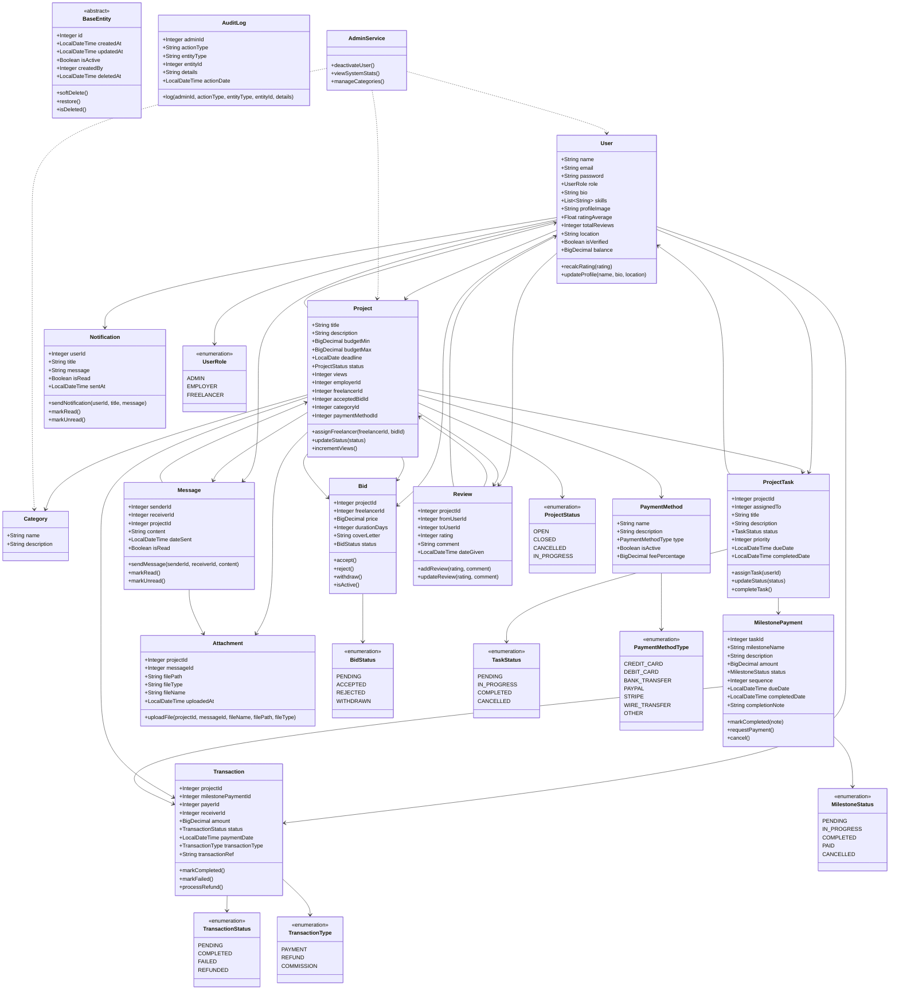

# UML Sınıf Diyagramı - Freelancer Platformu (Güncellenmiş ve Sadeleştirilmiş)

## Sadeleştirme Değişiklikleri

### ✅ Yapılan İyileştirmeler:

1. **BaseEntity Tablo Olarak Gösterildi:** BaseEntity artık inheritance okları olmadan normal bir tablo olarak duruyor
2. **İlişki Cardinality Bilgileri:** Her ilişkinin cardinality'si açıklama bölümünde detaylı şekilde belirtildi
3. **İlişki Okları Sadeleştirildi:** Karmaşık syntax yerine basit `-->` okları kullanıldı
4. **Enum İlişkileri Basitleştirildi:** Enum'larla entity'ler arasındaki ilişkiler sadeleştirildi
5. **Çoktan Çok İlişkiler:** User ↔ Review ilişkisi kaldırıldı, sadece Project üzerinden yönetiliyor

### 📋 Freelancer Platform İlişki Analizi:

#### 🏢 İşveren (Employer) İlişkileri:
- **User → Project (1:n):** Bir işveren birden fazla proje oluşturabilir
- **User → Message (1:n):** İşveren projeler hakkında mesajlaşabilir
- **User → Transaction (1:n):** İşveren ödemeler yapar
- **User → Review (1:n):** İşveren freelancer'ları değerlendirir

#### 💼 Freelancer İlişkileri:
- **User → Bid (1:n):** Bir freelancer birden fazla projeye teklif verebilir
- **User → ProjectTask (1:n):** Freelancer'a birden fazla görev atanabilir
- **User → Message (1:n):** Freelancer projeler hakkında mesajlaşabilir
- **User → Transaction (1:n):** Freelancer ödemeler alır
- **User → Review (1:n):** Freelancer işverenleri değerlendirir

#### 📋 Proje Yaşam Döngüsü İlişkileri:
- **Project → Bid (1:n):** Bir projeye birden fazla freelancer teklif verebilir
- **Project → ProjectTask (1:n):** Proje birden fazla görev içerebilir
- **Project → Message (1:n):** Proje hakkında mesajlaşma yapılabilir
- **Project → Review (1:n):** Proje tamamlandıktan sonra değerlendirme yapılabilir
- **Project → Attachment (1:n):** Projeye dosya eklenebilir
- **Project → Transaction (1:n):** Proje için ödemeler yapılabilir
- **Project → Category (n:1):** Proje bir kategoriye ait olmalı
- **Project → PaymentMethod (n:1):** Proje bir ödeme yöntemi kullanmalı
- **Project → Bid (1:1):** Proje sadece bir teklifi kabul edebilir
- **Project → User (n:1):** Proje bir freelancer'a atanır

#### ⚙️ Görev ve Ödeme İlişkileri:
- **ProjectTask → MilestonePayment (1:n):** Görev birden fazla milestone'a sahip olabilir
- **ProjectTask → User (n:1):** Görev bir kullanıcıya atanır
- **MilestonePayment → Transaction (1:n):** Milestone için ödeme yapılabilir

#### 💬 Mesajlaşma İlişkileri:
- **Message → Attachment (1:n):** Mesajda dosya paylaşılabilir
- **Message → Project (n:1):** Mesaj bir projeye ait olmalı

#### ⭐ Değerlendirme İlişkileri:
- **Review → Project (n:1):** Değerlendirme bir proje hakkında yapılır
- **Review → User (n:1):** Değerlendirme bir kullanıcı tarafından yapılır
- **Review → User (n:1):** Değerlendirme bir kullanıcıya yapılır

### 🔧 Teknik Notlar:

- **JPA İlişkileri:** Şu an Integer FK'ler kullanılıyor, ileride entity referanslarına dönüştürülebilir
- **Soft Delete:** BaseEntity üzerinden tüm entity'ler soft delete destekliyor
- **Audit Trail:** Tüm değişiklikler AuditLog ile takip ediliyor
- **Validation:** Tüm entity'lerde uygun validation annotation'ları mevcut

### 📊 İstatistikler:
- **Toplam Entity:** 12 ana entity
- **Toplam Enum:** 7 enum sınıfı
- **Toplam İlişki:** 20+ net ilişki
- **BaseEntity Kalıtımı:** 12 entity BaseEntity'den türetiliyor