# Güncellenmiş UML Sınıf Diyagramı - Freelancer Platformu

## Geliştirilen Özellikler

### 1. **Gelişmiş Ödeme Sistemi** ✅
- **PaymentPlan**: Proje ödeme planlarını yönetir
- **PaymentMilestone**: Milestone bazlı ödemeleri takip eder
- **EscrowAccount**: Güvenli ödeme tutma sistemi (escrow)
- **CommissionRate**: Platform komisyon oranları yönetimi
- **Transaction**: Detaylı finansal işlem kayıtları

### 2. **Güvenlik ve Doğrulama** ✅
- **EmailVerificationToken**: Email ve şifre sıfırlama token yönetimi
- **UserSession**: Oturum yönetimi ve güvenlik
- **AuditLog**: Tüm sistem işlemlerinin denetim kaydı

### 3. **Anlaşmazlık Yönetimi** ✅
- **Dispute**: Kullanıcılar arası anlaşmazlıklar
- **DisputeMessage**: Anlaşmazlık içi mesajlaşma
- **DisputeEvidence**: Kanıt ve belge yükleme

### 4. **Raporlama ve Moderasyon** ✅
- **Report**: Kullanıcı şikayet sistemi

### 5. **Gelişmiş Bildirim Sistemi** ✅
- **Notification**: Email, SMS, Push notification desteği
- Öncelik seviyeleri ve tiplendirme

## Güncellenmiş UML Diyagramı

```mermaid
classDiagram
    class BaseEntity {
        +Long id
        +LocalDateTime createdAt
        +LocalDateTime updatedAt
        +Boolean isActive
        +Long createdBy
        +LocalDateTime deletedAt
        +softDelete()
        +restore()
    }

    class User {
        +String username
        +String email
        +String password
        +String firstName
        +String lastName
        +UserRole role
        +UserStatus status
        +String bio
        +String skills
        +String profileImageUrl
        +BigDecimal ratingAverage
        +Integer totalReviews
        +String location
        +Boolean isVerified
        +Boolean isEmailVerified
        +String phoneNumber
        +BigDecimal hourlyRate
        +String availabilityStatus
        +LocalDateTime lastLoginAt
        +Integer failedLoginAttempts
        +LocalDateTime lockedUntil
        +getFullName()
        +isLocked()
        +incrementFailedLoginAttempts()
        +resetFailedLoginAttempts()
        +updateLastLogin()
        +recalculateRating()
    }

    class Project {
        +String title
        +String description
        +BigDecimal budgetMin
        +BigDecimal budgetMax
        +LocalDateTime deadline
        +Integer estimatedDurationDays
        +User employer
        +Category category
        +ProjectStatus status
        +ProjectType type
        +String attachmentUrl
        +Integer views
        +String requiredSkills
        +String experienceLevel
        +Boolean isFeatured
        +LocalDateTime featuredUntil
        +Boolean autoAcceptBids
        +Integer maxBids
        +String timezone
        +String preferredLanguage
        +Boolean isRemote
        +String location
        +incrementViews()
        +isOpenForBidding()
        +isCurrentlyFeatured()
        +getAcceptedBid()
        +getDurationInDays()
    }

    class Category {
        +String name
        +String description
        +String slug
        +String iconUrl
        +String colorCode
        +Category parent
        +Integer sortOrder
        +Boolean isFeatured
        +Integer projectCount
        +getFullPath()
        +isRootCategory()
        +hasSubcategories()
        +incrementProjectCount()
        +decrementProjectCount()
    }

    class Bid {
        +Project project
        +User freelancer
        +BigDecimal price
        +Integer durationDays
        +String coverLetter
        +BidStatus status
        +Boolean isFeatured
        +LocalDateTime featuredUntil
        +LocalDateTime acceptedAt
        +LocalDateTime rejectedAt
        +LocalDateTime withdrawnAt
        +String rejectionReason
        +String proposalAttachments
        +String milestoneProposal
        +String additionalNotes
        +Integer revisionCount
        +LocalDateTime lastRevisedAt
        +accept()
        +reject(reason)
        +withdraw()
        +isActive()
        +isCurrentlyFeatured()
        +getHourlyRate()
        +incrementRevision()
    }

    class PaymentPlan {
        +Project project
        +PaymentPlanType type
        +PaymentPlanStatus status
        +BigDecimal totalAmount
        +String description
        +Boolean autoReleaseEnabled
        +Integer autoReleaseDays
        +Long createdByUserId
        +Long approvedByUserId
        +LocalDateTime approvedAt
        +getTotalPaidAmount()
        +getRemainingAmount()
        +getCompletionPercentage()
        +isCompleted()
        +getNextPendingMilestone()
    }

    class PaymentMilestone {
        +PaymentPlan paymentPlan
        +String title
        +String description
        +BigDecimal amount
        +BigDecimal percentage
        +MilestoneStatus status
        +LocalDateTime dueDate
        +LocalDateTime completedAt
        +LocalDateTime paidAt
        +String deliverableDescription
        +String completionNotes
        +Boolean approvedByEmployer
        +Boolean approvedByFreelancer
        +Boolean autoApproveEnabled
        +Integer autoApproveDays
        +markCompleted()
        +markPaid()
        +isOverdue()
        +canBeAutoApproved()
        +getDaysUntilDue()
    }

    class EscrowAccount {
        +PaymentPlan paymentPlan
        +User employer
        +User freelancer
        +BigDecimal totalAmount
        +BigDecimal releasedAmount
        +BigDecimal heldAmount
        +EscrowStatus status
        +String releaseConditions
        +Boolean autoReleaseEnabled
        +LocalDateTime autoReleaseDate
        +Integer disputePeriodDays
        +LocalDateTime lastActivityAt
        +String externalAccountId
        +String paymentMethod
        +String currency
        +getRemainingAmount()
        +releaseAmount(amount)
        +addAmount(amount)
        +canBeAutoReleased()
        +isDisputePeriodActive()
        +getReleasePercentage()
    }

    class Transaction {
        +Project project
        +User payer
        +User receiver
        +BigDecimal amount
        +BigDecimal commissionAmount
        +BigDecimal netAmount
        +TransactionStatus status
        +TransactionType type
        +LocalDateTime paymentDate
        +String description
        +String externalTransactionId
        +String paymentMethod
        +String currency
        +BigDecimal exchangeRate
        +BigDecimal processingFee
        +BigDecimal refundAmount
        +String refundReason
        +LocalDateTime refundDate
        +String failureReason
        +Integer retryCount
        +LocalDateTime nextRetryAt
        +String metadata
        +calculateCommission(rate)
        +markCompleted()
        +markFailed(reason)
        +processRefund(amount, reason)
        +canRetry()
        +scheduleRetry()
        +getTotalFees()
    }

    class Message {
        +User sender
        +User receiver
        +Project project
        +String content
        +LocalDateTime dateSent
        +Boolean isRead
        +LocalDateTime readAt
        +String messageType
        +String priority
        +Boolean isEncrypted
        +String encryptionKeyId
        +Long replyToMessageId
        +Boolean isDeletedBySender
        +Boolean isDeletedByReceiver
        +LocalDateTime deletedAt
        +String metadata
        +markAsRead()
        +markAsUnread()
        +deleteForSender()
        +deleteForReceiver()
        +isVisibleToUser(userId)
        +isCompletelyDeleted()
        +getAgeInHours()
        +isRecent()
    }

    class Review {
        +Project project
        +User fromUser
        +User toUser
        +BigDecimal rating
        +String comment
        +LocalDateTime dateGiven
        +Boolean isPublic
        +Boolean isAnonymous
        +String recommendation
        +BigDecimal workQualityRating
        +BigDecimal communicationRating
        +BigDecimal timelinessRating
        +BigDecimal professionalismRating
        +Boolean wouldHireAgain
        +String responseComment
        +LocalDateTime responseDate
        +Boolean isEdited
        +LocalDateTime editedAt
        +String editReason
        +getRatingAsInt()
        +hasResponse()
        +addResponse(response)
        +markAsEdited(reason)
        +getDetailedRatingAverage()
        +isPositive()
        +isNegative()
        +getAgeInDays()
    }

    class Notification {
        +User user
        +String title
        +String message
        +NotificationType type
        +NotificationPriority priority
        +Boolean isRead
        +LocalDateTime readAt
        +LocalDateTime sentAt
        +LocalDateTime expiresAt
        +String actionUrl
        +String actionText
        +String relatedEntityType
        +Long relatedEntityId
        +Boolean isEmailSent
        +LocalDateTime emailSentAt
        +Boolean isSmsSent
        +LocalDateTime smsSentAt
        +Boolean isPushSent
        +LocalDateTime pushSentAt
        +String metadata
        +markAsRead()
        +markAsUnread()
        +isExpired()
        +isUrgent()
        +getAgeInHours()
        +isRecent()
        +markEmailSent()
        +markSmsSent()
        +markPushSent()
        +isFullyDelivered()
    }

    class Attachment {
        +Project project
        +Message message
        +String fileName
        +String originalFileName
        +String filePath
        +String fileUrl
        +AttachmentType type
        +String mimeType
        +Long fileSize
        +String fileHash
        +LocalDateTime uploadedAt
        +Long uploadedByUserId
        +Boolean isPublic
        +Integer downloadCount
        +LocalDateTime lastDownloadedAt
        +Boolean isVirusScanned
        +String virusScanResult
        +LocalDateTime virusScanDate
        +Boolean isEncrypted
        +String encryptionKeyId
        +LocalDateTime expiresAt
        +String metadata
        +incrementDownloadCount()
        +isExpired()
        +isSafe()
        +getFileSizeInMB()
        +isLarge()
        +getFileExtension()
        +isImage()
        +isDocument()
        +isArchive()
    }

    class EmailVerificationToken {
        +User user
        +String token
        +TokenType type
        +LocalDateTime expiresAt
        +LocalDateTime usedAt
        +Boolean isUsed
        +String ipAddress
        +String userAgent
        +Integer attempts
        +Integer maxAttempts
        +isExpired()
        +isValid()
        +markAsUsed()
        +incrementAttempts()
        +isMaxAttemptsReached()
        +getAgeInMinutes()
        +isRecent()
    }

    class UserSession {
        +User user
        +String sessionToken
        +SessionStatus status
        +String ipAddress
        +String userAgent
        +String deviceInfo
        +String browserInfo
        +String osInfo
        +String location
        +LocalDateTime lastActivityAt
        +LocalDateTime expiresAt
        +LocalDateTime logoutAt
        +String logoutReason
        +Boolean isRememberMe
        +Boolean isMobile
        +Boolean isSecure
        +Integer failedAttempts
        +Integer maxFailedAttempts
        +LocalDateTime lockedUntil
        +String metadata
        +updateLastActivity()
        +markAsExpired()
        +markAsLoggedOut(reason)
        +markAsTerminated(reason)
        +isExpired()
        +isActive()
        +isLocked()
        +incrementFailedAttempts()
        +resetFailedAttempts()
        +getDurationInMinutes()
        +getIdleTimeInMinutes()
        +isIdle()
    }

    class Dispute {
        +Project project
        +User creator
        +User respondent
        +DisputeType type
        +DisputeStatus status
        +String title
        +String description
        +BigDecimal disputedAmount
        +BigDecimal resolutionAmount
        +String resolutionNotes
        +LocalDateTime resolvedAt
        +Long resolvedByUserId
        +LocalDateTime escalatedAt
        +Long escalatedByUserId
        +Boolean mediationOffered
        +Boolean mediationAccepted
        +LocalDateTime mediationDate
        +String externalCaseId
        +String priority
        +LocalDateTime estimatedResolutionDate
        +LocalDateTime lastActivityAt
        +markAsResolved(notes, resolvedBy)
        +markAsClosed()
        +escalate(escalatedBy)
        +offerMediation()
        +acceptMediation()
        +isActive()
        +isEscalated()
        +getAgeInDays()
        +isOverdue()
    }

    class DisputeMessage {
        +Dispute dispute
        +User sender
        +String content
        +String messageType
        +Boolean isInternal
        +Boolean isVisibleToParties
        +Boolean isVisibleToMediator
        +Boolean isVisibleToAdmin
        +Boolean isEdited
        +LocalDateTime editedAt
        +String editReason
        +Boolean isDeleted
        +LocalDateTime deletedAt
        +Long deletedByUserId
        +String deletionReason
        +markAsEdited(reason)
        +markAsDeleted(deletedBy, reason)
        +isVisibleToUser(userId, userRole)
        +isRecent()
    }

    class DisputeEvidence {
        +Dispute dispute
        +User uploadedBy
        +EvidenceType type
        +String title
        +String description
        +String fileName
        +String filePath
        +String fileUrl
        +Long fileSize
        +String mimeType
        +LocalDateTime uploadedAt
        +Boolean isVerified
        +LocalDateTime verifiedAt
        +Long verifiedByUserId
        +String verificationNotes
        +Boolean isPublic
        +String accessLevel
        +Integer downloadCount
        +LocalDateTime lastDownloadedAt
        +Boolean isEncrypted
        +String encryptionKeyId
        +LocalDateTime expiresAt
        +String metadata
        +markAsVerified(verifiedBy, notes)
        +incrementDownloadCount()
        +isExpired()
        +isAccessibleToUser(userId, userRole)
        +getFileSizeInMB()
        +isLarge()
    }

    class Report {
        +User reporter
        +User reportedUser
        +Project reportedProject
        +ReportType type
        +ReportStatus status
        +String reason
        +String description
        +LocalDateTime reviewedAt
        +Long reviewedByUserId
        +String actionTaken
        +String resolutionNotes
        +markAsResolved(reviewedBy, action, notes)
    }

    class CommissionRate {
        +String name
        +BigDecimal rate
        +BigDecimal minAmount
        +BigDecimal maxAmount
        +String userRole
        +String projectCategory
        +LocalDateTime effectiveFrom
        +LocalDateTime effectiveUntil
        +Boolean isDefault
        +String description
        +isEffective()
        +calculateCommission(amount)
    }

    class AuditLog {
        +User user
        +String actionType
        +String entityType
        +Long entityId
        +String details
        +LocalDateTime actionDate
        +String ipAddress
        +String userAgent
        +String oldValues
        +String newValues
    }

    %% Inheritance
    BaseEntity <|-- User
    BaseEntity <|-- Project
    BaseEntity <|-- Category
    BaseEntity <|-- Bid
    BaseEntity <|-- PaymentPlan
    BaseEntity <|-- PaymentMilestone
    BaseEntity <|-- EscrowAccount
    BaseEntity <|-- Transaction
    BaseEntity <|-- Message
    BaseEntity <|-- Review
    BaseEntity <|-- Notification
    BaseEntity <|-- Attachment
    BaseEntity <|-- EmailVerificationToken
    BaseEntity <|-- UserSession
    BaseEntity <|-- Dispute
    BaseEntity <|-- DisputeMessage
    BaseEntity <|-- DisputeEvidence
    BaseEntity <|-- Report
    BaseEntity <|-- CommissionRate
    BaseEntity <|-- AuditLog

    %% User Relationships
    User "1" --> "N" Project : employer
    User "1" --> "N" Bid : freelancer
    User "1" --> "N" Message : sender/receiver
    User "1" --> "N" Review : from/to
    User "1" --> "N" Notification : user
    User "1" --> "N" EmailVerificationToken : user
    User "1" --> "N" UserSession : user
    User "1" --> "N" Dispute : creator/respondent
    User "1" --> "N" Report : reporter/reported
    User "1" --> "N" AuditLog : user

    %% Category Relationships
    Category "1" --> "N" Project : category
    Category "1" --> "N" Category : subcategories

    %% Project Relationships
    Project "1" --> "N" Bid : project
    Project "1" --> "N" Message : project
    Project "1" --> "N" Review : project
    Project "1" --> "N" Transaction : project
    Project "1" --> "N" Attachment : project
    Project "1" --> "N" PaymentPlan : project
    Project "1" --> "N" Dispute : project

    %% Payment System Relationships
    PaymentPlan "1" --> "N" PaymentMilestone : paymentPlan
    PaymentPlan "1" --> "N" EscrowAccount : paymentPlan
    EscrowAccount "N" --> "1" User : employer/freelancer

    %% Dispute Relationships
    Dispute "1" --> "N" DisputeMessage : dispute
    Dispute "1" --> "N" DisputeEvidence : dispute

    %% Message Relationships
    Message "1" --> "N" Attachment : message
```

## Enum Sınıfları

### User Related
- **UserRole**: FREELANCER, EMPLOYER, ADMIN, MODERATOR
- **UserStatus**: PENDING_VERIFICATION, ACTIVE, SUSPENDED, BANNED, INACTIVE

### Project Related
- **ProjectStatus**: OPEN, IN_PROGRESS, COMPLETED, CANCELLED, ON_HOLD, CLOSED
- **ProjectType**: FIXED_PRICE, HOURLY, MILESTONE

### Bid Related
- **BidStatus**: PENDING, ACCEPTED, REJECTED, WITHDRAWN, EXPIRED

### Payment Related
- **PaymentPlanType**: MILESTONE_BASED, PERCENTAGE_BASED, FIXED_SCHEDULE, MANUAL
- **PaymentPlanStatus**: DRAFT, ACTIVE, COMPLETED, CANCELLED, SUSPENDED
- **MilestoneStatus**: PENDING, IN_PROGRESS, COMPLETED, PAID, DISPUTED, CANCELLED
- **EscrowStatus**: ACTIVE, COMPLETED, DISPUTED, CANCELLED, SUSPENDED

### Transaction Related
- **TransactionStatus**: PENDING, PROCESSING, COMPLETED, FAILED, CANCELLED, REFUNDED, PARTIALLY_REFUNDED
- **TransactionType**: PAYMENT, REFUND, COMMISSION, WITHDRAWAL, DEPOSIT, ESCROW_RELEASE, ESCROW_HOLD, DISPUTE_RESOLUTION, BONUS, PENALTY

### Notification Related
- **NotificationType**: PROJECT_CREATED, BID_PLACED, PAYMENT_RECEIVED, REVIEW_RECEIVED, DISPUTE_CREATED, etc.
- **NotificationPriority**: LOW, NORMAL, HIGH, URGENT

### Security Related
- **TokenType**: EMAIL_VERIFICATION, PASSWORD_RESET, ACCOUNT_ACTIVATION, TWO_FACTOR_AUTH
- **SessionStatus**: ACTIVE, EXPIRED, LOGGED_OUT, TERMINATED, SUSPENDED

### Dispute Related
- **DisputeStatus**: OPEN, IN_REVIEW, RESOLVED, CLOSED, ESCALATED, MEDIATION, CANCELLED
- **DisputeType**: PAYMENT_DISPUTE, WORK_QUALITY, SCOPE_CREEP, DEADLINE_ISSUE, etc.

### Report Related
- **ReportStatus**: PENDING, IN_REVIEW, RESOLVED, DISMISSED, ESCALATED
- **ReportType**: SPAM, HARASSMENT, FRAUD, INAPPROPRIATE_CONTENT, etc.

### Attachment Related
- **AttachmentType**: PROJECT_FILE, MESSAGE_ATTACHMENT, PROFILE_IMAGE, PORTFOLIO_ITEM, etc.
- **EvidenceType**: DOCUMENT, SCREENSHOT, EMAIL, MESSAGE, AUDIO, VIDEO, etc.

## Temel İyileştirmeler

1. ✅ **Project Owner Eklendi**: `employer` field'ı ile proje sahibi takip ediliyor
2. ✅ **Çok Katmanlı Ödeme Sistemi**: Milestone, escrow ve komisyon yönetimi
3. ✅ **Gerçek Email Doğrulama**: Token bazlı email verification sistemi
4. ✅ **Güvenlik Sistemi**: Session management, audit logs, rate limiting hazır
5. ✅ **Anlaşmazlık Yönetimi**: Dispute resolution ve mediation sistemi
6. ✅ **Raporlama**: User reports ve moderasyon sistemi
7. ✅ **Detaylı İlişkiler**: Tüm entity ilişkileri JPA annotations ile tanımlandı
8. ✅ **Business Logic**: Entity sınıflarında iş kuralları metodları eklendi
9. ✅ **Soft Delete**: BaseEntity'de soft delete desteği
10. ✅ **Auditing**: Otomatik created/updated timestamp tracking

## Sonraki Adımlar

1. DTO sınıflarının oluşturulması
2. Repository katmanının oluşturulması
3. Service katmanının oluşturulması
4. Controller katmanının oluşturulması
5. Security configuration
6. Email servisi entegrasyonu
7. Payment gateway entegrasyonu
8. Veritabanı migration scriptleri

