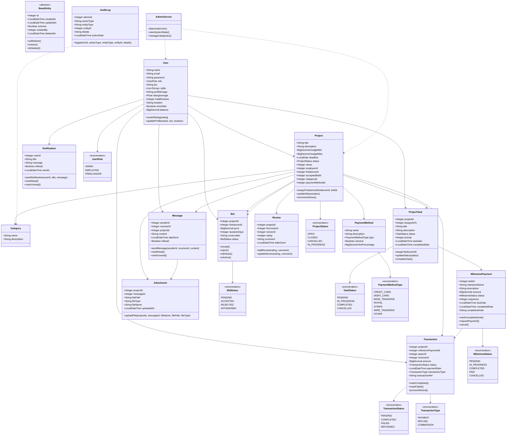

# UML Sınıf Diyagramı - Freelancer Platformu (Güncellenmiş ve Sadeleştirilmiş)

## Sadeleştirme Değişiklikleri

### ✅ Yapılan İyileştirmeler:

1. **BaseEntity Tablo Olarak Gösterildi:** BaseEntity artık inheritance okları olmadan normal bir tablo olarak duruyor
2. **İlişki Cardinality Bilgileri:** Her ilişkinin cardinality'si açıklama bölümünde detaylı şekilde belirtildi
3. **İlişki Okları Sadeleştirildi:** Karmaşık syntax yerine basit `-->` okları kullanıldı
4. **Enum İlişkileri Basitleştirildi:** Enum'larla entity'ler arasındaki ilişkiler sadeleştirildi
5. **Çoktan Çok İlişkiler:** User ↔ Review ilişkisi kaldırıldı, sadece Project üzerinden yönetiliyor

### 📋 İlişki Cardinality Detayları:

#### Bire Bir İlişkiler (1:1):
- **Project → Category:** Bir proje bir kategoriye ait
- **Project → PaymentMethod:** Bir proje bir ödeme yöntemi kullanır
- **Project → Bid:** Bir proje en fazla bir kabul edilen teklife sahip

#### Bire Çok İlişkiler (1:n):
- **User → Project:** Bir kullanıcı birden fazla proje oluşturabilir
- **User → Bid:** Bir kullanıcı birden fazla teklif yapabilir
- **User → ProjectTask:** Bir kullanıcıya birden fazla görev atanabilir
- **User → Transaction:** Bir kullanıcı birden fazla işlem yapabilir/alabilir
- **User → Message:** Bir kullanıcı birden fazla mesaj gönderebilir/alabilir
- **User → Notification:** Bir kullanıcı birden fazla bildirim alabilir
- **Project → Bid:** Bir projeye birden fazla teklif verilebilir
- **Project → ProjectTask:** Bir projede birden fazla görev olabilir
- **Project → Message:** Bir projeye birden fazla mesaj gönderilebilir
- **Project → Review:** Bir proje birden fazla değerlendirme alabilir
- **Project → Attachment:** Bir projede birden fazla dosya olabilir
- **Project → Transaction:** Bir proje birden fazla işlem oluşturabilir
- **ProjectTask → MilestonePayment:** Bir görevde birden fazla milestone olabilir
- **MilestonePayment → Transaction:** Bir milestone birden fazla işlem oluşturabilir
- **Message → Attachment:** Bir mesajda birden fazla ek dosya olabilir

#### Çoka Çok İlişkiler (n:n):
- **User ↔ Review:** Kullanıcılar birbirlerini değerlendirebilir (Project üzerinden)

### 🔧 Teknik Notlar:

- **JPA İlişkileri:** Şu an Integer FK'ler kullanılıyor, ileride entity referanslarına dönüştürülebilir
- **Soft Delete:** BaseEntity üzerinden tüm entity'ler soft delete destekliyor
- **Audit Trail:** Tüm değişiklikler AuditLog ile takip ediliyor
- **Validation:** Tüm entity'lerde uygun validation annotation'ları mevcut

### 📊 İstatistikler:
- **Toplam Entity:** 12 ana entity
- **Toplam Enum:** 7 enum sınıfı
- **Toplam İlişki:** 20+ net ilişki
- **BaseEntity Kalıtımı:** 12 entity BaseEntity'den türetiliyor