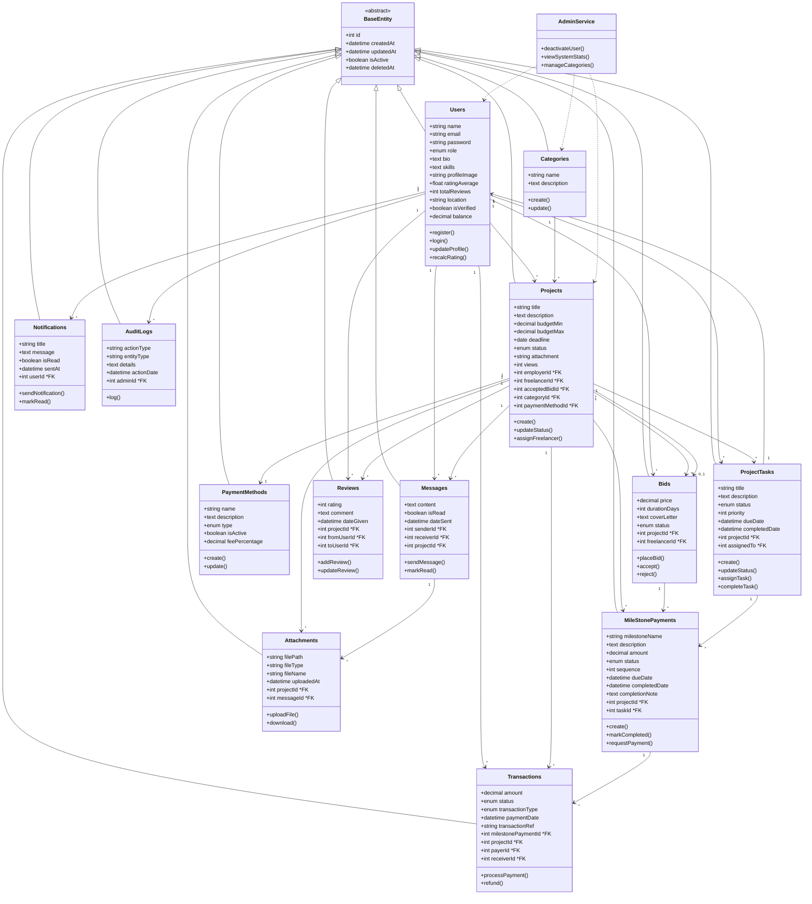

# UML Sınıf Diyagramı - Freelancer Platformu

```mermaid
classDiagram
    class BaseEntity {
        <<abstract>>
        +int id
        +datetime createdAt
        +datetime updatedAt
        +boolean isActive
        +datetime deletedAt
    }

    class Users {
        +string name
        +string email
        +string password
        +enum role
        +text bio
        +text skills
        +string profileImage
        +float ratingAverage
        +int totalReviews
        +string location
        +boolean isVerified
        +decimal balance
        +register()
        +login()
        +updateProfile()
        +recalcRating()
    }

    class Projects {
        +string title
        +text description
        +decimal budgetMin
        +decimal budgetMax
        +date deadline
        +enum status
        +string attachment
        +int views
        +int employerId *FK
        +int freelancerId *FK
        +int acceptedBidId *FK
        +int categoryId *FK
        +int paymentMethodId *FK
        +create()
        +updateStatus()
        +assignFreelancer()
    }

    class Categories {
        +string name
        +text description
        +create()
        +update()
    }

    class Bids {
        +decimal price
        +int durationDays
        +text coverLetter
        +enum status
        +int projectId *FK
        +int freelancerId *FK
        +placeBid()
        +accept()
        +reject()
    }

    class ProjectTasks {
        +string title
        +text description
        +enum status
        +int priority
        +datetime dueDate
        +datetime completedDate
        +int projectId *FK
        +int assignedTo *FK
        +create()
        +updateStatus()
        +assignTask()
        +completeTask()
    }

    class PaymentMethods {
        +string name
        +text description
        +enum type
        +boolean isActive
        +decimal feePercentage
        +create()
        +update()
    }

    class MileStonePayments {
        +string milestoneName
        +text description
        +decimal amount
        +enum status
        +int sequence
        +datetime dueDate
        +datetime completedDate
        +text completionNote
        +int projectId *FK
        +int taskId *FK
        +create()
        +markCompleted()
        +requestPayment()
    }

    class Transactions {
        +decimal amount
        +enum status
        +enum transactionType
        +datetime paymentDate
        +string transactionRef
        +int milestonePaymentId *FK
        +int projectId *FK
        +int payerId *FK
        +int receiverId *FK
        +processPayment()
        +refund()
    }

    class Messages {
        +text content
        +boolean isRead
        +datetime dateSent
        +int senderId *FK
        +int receiverId *FK
        +int projectId *FK
        +sendMessage()
        +markRead()
    }

    class Reviews {
        +int rating
        +text comment
        +datetime dateGiven
        +int projectId *FK
        +int fromUserId *FK
        +int toUserId *FK
        +addReview()
        +updateReview()
    }

    class Notifications {
        +string title
        +text message
        +boolean isRead
        +datetime sentAt
        +int userId *FK
        +sendNotification()
        +markRead()
    }

    class Attachments {
        +string filePath
        +string fileType
        +string fileName
        +datetime uploadedAt
        +int projectId *FK
        +int messageId *FK
        +uploadFile()
        +download()
    }

    class AuditLogs {
        +string actionType
        +string entityType
        +text details
        +datetime actionDate
        +int adminId *FK
        +log()
    }

    class AdminService {
        +deactivateUser()
        +viewSystemStats()
        +manageCategories()
    }

    %% INHERITANCE
    BaseEntity <|-- Users
    BaseEntity <|-- Projects
    BaseEntity <|-- Categories
    BaseEntity <|-- Bids
    BaseEntity <|-- ProjectTasks
    BaseEntity <|-- PaymentMethods
    BaseEntity <|-- MileStonePayments
    BaseEntity <|-- Transactions
    BaseEntity <|-- Messages
    BaseEntity <|-- Reviews
    BaseEntity <|-- Notifications
    BaseEntity <|-- Attachments
    BaseEntity <|-- AuditLogs

    %% RELATIONSHIPS
    Users "1" --> "*" Projects
    Users "1" --> "*" Bids
    Users "1" --> "*" ProjectTasks
    Users "1" --> "*" Transactions
    Users "1" --> "*" Messages
    Users "1" --> "*" Reviews
    Users "1" --> "*" Notifications
    Users "1" --> "*" AuditLogs
    
    Projects "1" --> "*" Bids
    Projects "1" --> "*" ProjectTasks
    Projects "1" --> "*" MileStonePayments
    Projects "1" --> "*" Transactions
    Projects "1" --> "*" Messages
    Projects "1" --> "*" Reviews
    Projects "1" --> "*" Attachments
    Projects "*" --> "0..1" Bids
    Projects "1" --> "1" PaymentMethods
    
    Categories "1" --> "*" Projects
    
    Bids "1" --> "*" MileStonePayments
    
    ProjectTasks "1" --> "*" MileStonePayments
    ProjectTasks "1" --> "1" Users
    
    MileStonePayments "1" --> "*" Transactions
    
    Messages "1" --> "*" Attachments
    
    AdminService ..> Users
    AdminService ..> Projects
    AdminService ..> Categories
```
