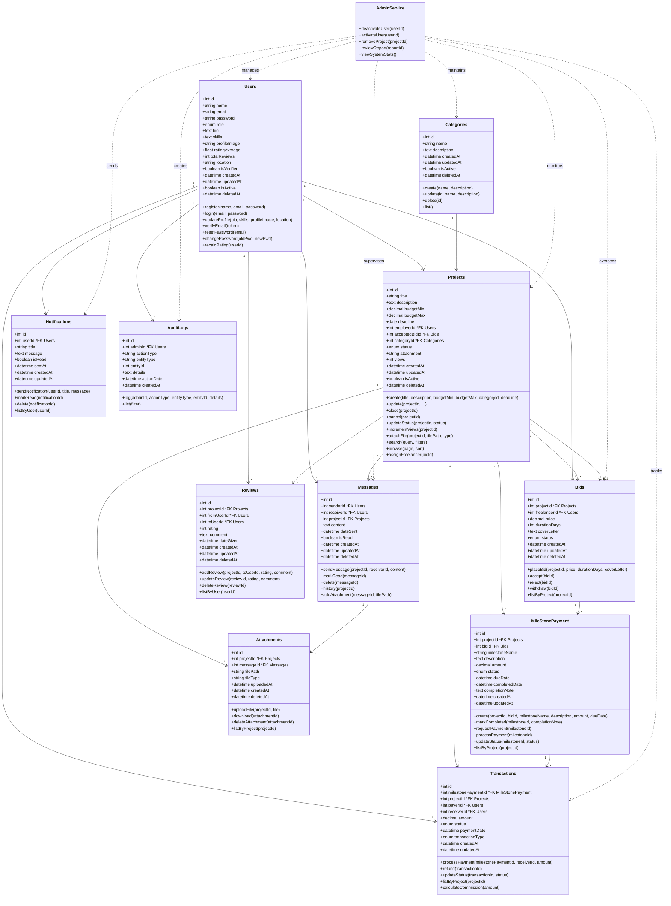

# UML Sınıf Diyagramı (Metodlarla) - Freelancer Platformu

```mermaid
classDiagram
    class Users {
        +int id
        +string name
        +string email
        +string password
        +enum role
        +text bio
        +text skills
        +string profileImage
        +float ratingAverage
        +int totalReviews
        +string location
        +boolean isVerified
        +datetime createdAt
        +datetime updatedAt
        +boolean isActive
        +datetime deletedAt
        +register(name, email, password)
        +login(email, password)
        +updateProfile(bio, skills, profileImage, location)
        +verifyEmail(token)
        +resetPassword(email)
        +changePassword(oldPwd, newPwd)
        +recalcRating(userId)
    }

    class Projects {
        +int id
        +string title
        +text description
        +decimal budgetMin
        +decimal budgetMax
        +date deadline
        +int employerId *FK Users
        +int acceptedBidId *FK Bids
        +int categoryId *FK Categories
        +enum status
        +string attachment
        +int views
        +datetime createdAt
        +datetime updatedAt
        +boolean isActive
        +datetime deletedAt
        +create(title, description, budgetMin, budgetMax, categoryId, deadline)
        +update(projectId, ...)
        +close(projectId)
        +cancel(projectId)
        +updateStatus(projectId, status)
        +incrementViews(projectId)
        +attachFile(projectId, filePath, type)
        +search(query, filters)
        +browse(page, sort)
        +assignFreelancer(bidId)
    }

    class Categories {
        +int id
        +string name
        +text description
        +datetime createdAt
        +datetime updatedAt
        +boolean isActive
        +datetime deletedAt
        +create(name, description)
        +update(id, name, description)
        +delete(id)
        +list()
    }

    class Bids {
        +int id
        +int projectId *FK Projects
        +int freelancerId *FK Users
        +decimal price
        +int durationDays
        +text coverLetter
        +enum status
        +datetime createdAt
        +datetime updatedAt
        +datetime deletedAt
        +placeBid(projectId, price, durationDays, coverLetter)
        +accept(bidId)
        +reject(bidId)
        +withdraw(bidId)
        +listByProject(projectId)
    }

    class MileStonePayment {
        +int id
        +int projectId *FK Projects
        +int bidId *FK Bids
        +string milestoneName
        +text description
        +decimal amount
        +enum status
        +datetime dueDate
        +datetime completedDate
        +text completionNote
        +datetime createdAt
        +datetime updatedAt
        +create(projectId, bidId, milestoneName, description, amount, dueDate)
        +markCompleted(milestoneId, completionNote)
        +requestPayment(milestoneId)
        +processPayment(milestoneId)
        +updateStatus(milestoneId, status)
        +listByProject(projectId)
    }

    class Messages {
        +int id
        +int senderId *FK Users
        +int receiverId *FK Users
        +int projectId *FK Projects
        +text content
        +datetime dateSent
        +boolean isRead
        +datetime createdAt
        +datetime updatedAt
        +datetime deletedAt
        +sendMessage(projectId, receiverId, content)
        +markRead(messageId)
        +delete(messageId)
        +history(projectId)
        +addAttachment(messageId, filePath)
    }

    class Reviews {
        +int id
        +int projectId *FK Projects
        +int fromUserId *FK Users
        +int toUserId *FK Users
        +int rating
        +text comment
        +datetime dateGiven
        +datetime createdAt
        +datetime updatedAt
        +datetime deletedAt
        +addReview(projectId, toUserId, rating, comment)
        +updateReview(reviewId, rating, comment)
        +deleteReview(reviewId)
        +listByUser(userId)
    }

    class Transactions {
        +int id
        +int milestonePaymentId *FK MileStonePayment
        +int projectId *FK Projects
        +int payerId *FK Users
        +int receiverId *FK Users
        +decimal amount
        +enum status
        +datetime paymentDate
        +enum transactionType
        +datetime createdAt
        +datetime updatedAt
        +processPayment(milestonePaymentId, receiverId, amount)
        +refund(transactionId)
        +updateStatus(transactionId, status)
        +listByProject(projectId)
        +calculateCommission(amount)
    }

    class Notifications {
        +int id
        +int userId *FK Users
        +string title
        +text message
        +boolean isRead
        +datetime sentAt
        +datetime createdAt
        +datetime updatedAt
        +sendNotification(userId, title, message)
        +markRead(notificationId)
        +delete(notificationId)
        +listByUser(userId)
    }

    class Attachments {
        +int id
        +int projectId *FK Projects
        +int messageId *FK Messages
        +string filePath
        +string fileType
        +datetime uploadedAt
        +datetime createdAt
        +datetime deletedAt
        +uploadFile(projectId, file)
        +download(attachmentId)
        +deleteAttachment(attachmentId)
        +listByProject(projectId)
    }

    class AuditLogs {
        +int id
        +int adminId *FK Users
        +string actionType
        +string entityType
        +int entityId
        +text details
        +datetime actionDate
        +datetime createdAt
        +log(adminId, actionType, entityType, entityId, details)
        +list(filter)
    }

    class AdminService {
        +deactivateUser(userId)
        +activateUser(userId)
        +removeProject(projectId)
        +reviewReport(reportId)
        +viewSystemStats()
    }

    %% RELATIONSHIPS - ONE TO MANY (1 to N)
    
    Users "1" --> "*" Projects
    Users "1" --> "*" Bids
    Users "1" --> "*" Messages
    Users "1" --> "*" Reviews
    Users "1" --> "*" Transactions
    Users "1" --> "*" Notifications
    Users "1" --> "*" AuditLogs
    
    Categories "1" --> "*" Projects
    
    Projects "1" --> "*" Bids
    Projects "1" --> "*" Messages
    Projects "1" --> "*" Reviews
    Projects "1" --> "*" MileStonePayment
    Projects "1" --> "*" Transactions
    Projects "1" --> "*" Attachments
    
    Bids "1" --> "*" MileStonePayment
    
    MileStonePayment "1" --> "*" Transactions
    
    Messages "1" --> "*" Attachments
    
    %% RELATIONSHIPS - MANY TO ONE (OPTIONAL)
    
    Projects "*" --> "0..1" Bids
    
    %% SERVICE RELATIONSHIPS
    AdminService ..> Users : manages
    AdminService ..> Projects : monitors
    AdminService ..> Bids : oversees
    AdminService ..> Messages : supervises
    AdminService ..> Transactions : tracks
    AdminService ..> Notifications : sends
    AdminService ..> Categories : maintains
    AdminService ..> AuditLogs : creates
```
